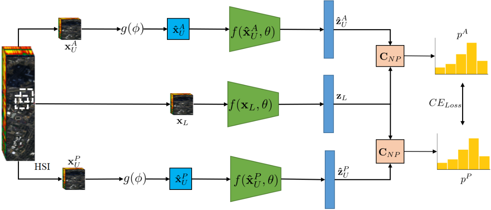

# Semi-Supervised learning for Hyperspectral-Images by Non Parametrically Predciting View Assignment
Hyperspectral image (HSI) classification is gaining a lot of momentum in present time because of high inherent spectral information within the images. However, these images suffer from the problem of curse of dimensionality and usually require a large number samples for tasks such as classification, especially in supervised setting. Recently, to effectively train the deep learning models with minimal labelled samples, the unlabeled samples are also being leveraged in self-supervised and semi-supervised setting. In this work, we leverage the idea of semi-supervised learning to assist the discriminative self-supervised pretraining of the models. The proposed method takes different augmented views of the unlabeled samples as input and assigns them the same pseudo-label corresponding to the labelled sample from the downstream task. We train our model on two HSI datasets, anemly Houston dataset (from data fusion contest, 2013) and Pavia university dataset, and show that the proposed approach performs better than self-supervised approach and supervised training.

 

# URL to the paper: 
>[Paper](https://arxiv.org/pdf/2306.10955)

# Requirement:

```
Tensorflow 2
```
# Steps:

```
1. Download the dataset from the provided URL in data folder
```
```
2. Run data_prepare.py
```
```
3. Run model_bgae.py
```
# Citation

If using the concept or code, kindly cite the paper as: 
>S. Pande, N.A.A> Braham, Y. Wang, C.M. Albrecht, B. Banerjee, X.X. Zhu. Bidirectional GRU based autoencoder for dimensionality reduction in hyperspectral images. IEEE International Geoscience and Remote Sensing Symposium (IGARSS), July, 2023.

You can also use the bibtex as:
```
@article{pande2023semi,
  title={Semi-Supervised Learning for hyperspectral images by non parametrically predicting view assignment},
  author={Pande, Shivam and Braham, Nassim Ait Ali and Wang, Yi and Albrecht, Conrad M and Banerjee, Biplab and Zhu, Xiao Xiang},
  journal={arXiv preprint arXiv:2306.10955},
  year={2023}
}

```
